# SPY-Based TQQQ Investment Strategy Implementation Plan

## Strategy Overview

This plan implements a new investment strategy that uses SPY (S&P 500) as the primary signal source instead of TQQQ, with QQQ providing bubble protection.

## Decision Logic Flow

```mermaid
flowchart TD
    A[Daily Analysis] --> B[Fetch SPY Data]
    A --> C[Fetch QQQ Data]
    
    B --> D[Calculate SPY vs 200-day SMA]
    C --> E[Calculate QQQ vs 200-day SMA]
    
    D --> F{QQQ > 40% above SMA?}
    F -->|Yes| G[🚨 EXIT TO CASH]
    F -->|No| H{QQQ 30-40% above SMA?}
    
    H -->|Yes| I[⚠️ DELEVERAGE TO QQQ]
    H -->|No| J{SPY Position?}
    
    J -->|SPY < -3%| K[📉 SELL TQQQ, DCA INTO QQQ]
    J -->|SPY > +4%| L[✅ BUY/HOLD TQQQ]
    J -->|Between -3% and +4%| M[⏸️ MAINTAIN CURRENT POSITION]
    
    G --> N[Send Email Alert]
    I --> N
    K --> N
    L --> N
    M --> N
```



## Key Changes Required

### 1. Configuration Changes
- Add `spy_symbol` and `qqq_symbol` to settings
- Keep existing `symbol` for TQQQ reference
- Add threshold parameters: `spy_buy_threshold` (+4%), `spy_sell_threshold` (-3%), `qqq_warning_threshold` (30%), `qqq_danger_threshold` (40%)

### 2. Data Fetching Changes
**Current**: Fetches TQQQ daily prices only
**New**: Fetch all three tickers:
- SPY: Primary signal source
- QQQ: Bubble protection monitor
- TQQQ: Reference (optional display)

### 3. Analysis Logic Changes
**Current**: Single ticker analysis comparing price to SMA
**New**: Multi-ticker analysis with priority logic:
1. Check QQQ danger level (40%+) → EXIT
2. Check QQQ warning level (30-40%) → DELEVERAGE
3. Check SPY sell signal (-3%) → SELL/DCA
4. Check SPY buy signal (+4%) → BUY/HOLD
5. Default → MAINTAIN

### 4. Email Template Changes
**Current Email Structure**:
```
Subject: TQQQ Analysis: ABOVE 200-Day SMA - 2025-10-22

[Single ticker data]
- Current Price
- 200-day SMA
- Percentage difference
```

**New Email Structure**:
```
Subject: TQQQ Strategy: [ACTION] - 2025-10-22

[Prominent Action Box]
📊 CURRENT RECOMMENDATION: BUY/HOLD TQQQ

[Multi-Ticker Dashboard]
SPY (Primary Signal):
- Current: $450.00
- 200-day SMA: $432.00
- Difference: +4.17% 🟢 [ABOVE BUY THRESHOLD]

QQQ (Bubble Protection):
- Current: $380.00
- 200-day SMA: $340.00
- Difference: +11.76% 🟢 [SAFE ZONE]

[Signal Explanation]
SPY is above the +4% buy threshold and QQQ is below the 30% warning level.
This indicates a bullish market with no bubble concerns.
```

### 5. Color Coding Rules

**Green (🟢) Indicators**:
- SPY above +4% (bullish)
- SPY between -3% and +4% when holding (neutral good)
- QQQ below 30% (safe)

**Red (🔴) Indicators**:
- SPY below -3% (bearish)
- QQQ above 30% (warning)
- QQQ above 40% (danger)

## Implementation Approach

### Phase 1: Configuration & Data (Steps 1-2)
- Minimal changes to settings structure
- Add new ticker symbols
- Modify fetch_data() to get all three tickers

### Phase 2: Analysis Logic (Steps 3-4)
- Create new `MultiTickerAnalyzer` class or extend `StockComparator`
- Implement priority-based decision logic
- Generate investment recommendations

### Phase 3: Email Presentation (Steps 5-8)
- Redesign email templates
- Add action recommendation box at top
- Implement color coding
- Add threshold indicators

### Phase 4: Testing & Documentation (Steps 9-10)
- Test all signal scenarios
- Update README with new strategy
- Document threshold parameters

## Files to Modify

1. **sma_crossover_alerts/src/sma_crossover_alerts/config/settings.py**
   - Add new ticker symbols and threshold parameters

2. **sma_crossover_alerts/main.py**
   - Update fetch_data() for multi-ticker
   - Update process_data() for multi-ticker SMA calculation
   - Update compare_data() to use new decision logic

3. **sma_crossover_alerts/src/sma_crossover_alerts/analysis/comparator.py**
   - Add new methods for multi-ticker analysis
   - Implement investment recommendation logic
   - Add threshold evaluation methods

4. **sma_crossover_alerts/src/sma_crossover_alerts/notification/templates.py**
   - Redesign HTML template with action box
   - Add multi-ticker display
   - Implement color coding
   - Update text template similarly

5. **sma_crossover_alerts/README.md**
   - Document new strategy
   - Update configuration examples

## Testing Scenarios

1. **Normal Buy Signal**: SPY +5%, QQQ +15% → BUY/HOLD TQQQ
2. **Normal Sell Signal**: SPY -4%, QQQ +10% → SELL TQQQ, DCA QQQ
3. **Bubble Warning**: SPY +6%, QQQ +35% → DELEVERAGE TO QQQ
4. **Bubble Danger**: SPY +8%, QQQ +45% → EXIT TO CASH
5. **Neutral Zone**: SPY +2%, QQQ +12% → MAINTAIN POSITION

## Success Criteria

- ✅ Email displays all three tickers correctly
- ✅ Investment recommendation is prominent and clear
- ✅ Color coding works correctly for all threshold scenarios
- ✅ Signal detection highlights threshold crossings
- ✅ System maintains existing daily email functionality
- ✅ Changes are surgical and don't break existing features